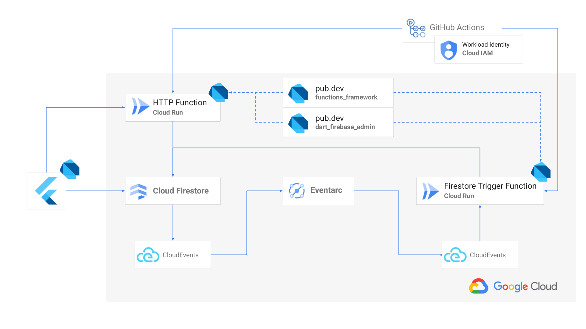

# **FlutterNinjas 2024** 

**Exploring Full-Stack Dart for Firebase Server-Side Development**

Kosuke (@kosukesaigusa)

---

<!-- _class: lead -->

#  Hello, Flutter Ninjas! 💙

---

# About me

<style scoped>section { font-size: 32px; }</style>


- 🇯🇵 Application Engineer located in Japan
  - Current: Omiai Inc.
  - Previous: SODA Inc. (snkrdunk)
- 💙 Flutter, Dart lover
- 👨‍💻 OSS contributor (pub.dev)
  - geoflutterfire_plus
  - flutterfire_gen
  - dart_firebase_functions
  - ...

---

# Explore Full-Stack Dart


<!-- - 世界中からやってきた FlutterNinjas の皆さんこんにちは！
- 私たちは皆 Flutter を愛しています
- 同時に Dart 言語も愛しています
- Flutter でクロスプラットフォームなクライアントアプリを実装する時、サーバサイドも Dart 言語で書くことができたらどんなに嬉しいことでしょうか！（テキスト少なめで Flutter のロゴ、iOS, Android, Web, Linux, macOS, Windows などのアイコン、Dart のロゴなどを並べると良いかも）
- おまけに FlutterFire も好きな人は多いでしょう -->

---

# Goal

## **Exploring Full-Stack Dart for Firebase Server-Side Development**

- Develop server-side processes for Firebase using Dart
- Integration of various GCP services
- Implement solutions with pub.dev packages:
  - `functions_framework`
  - `dart_firebase_admin`

---

<!-- _class: lead -->

#  Demo

Demo to show sample app.

---

# Overview



---

# Table of contents

1. ...
2. ...

---

# Cloud Run


<!-- - Cloud Run とはなにか
  - Cloud Functions (2ng Gen) も裏側では Cloud Run で動くようになっている
- なぜ Cloud Run を使用するのか
  - コンテナイメージをビルドできるものでは、任意のプログラミング言語で記述されたコードをデプロイできることが重要 -->

> Cloud Run is a managed compute platform that lets you run containers directly on top of Google's scalable infrastructure.
>
> You can deploy code **written in any programming language** on Cloud Run **if you can build a container image** from it.

---

# Compile Dart program to executable

<style scoped>section { font-size: 30px; }</style>

`bin/hello.dart`

```dart
void main(List<String> arguments) {
  print('Hello, Flutter Ninjas!');
}
```

Compile to executable:

```sh
dart compile exe bin/hello.dart -o bin/hello
```

Run:

```sh
$ ./bin/hello
Hello, Flutter Ninjas!
```

---

# functions_framework package

- Developed in `GoogleCloudPlatform` organization
- Provide a framework to write Dart functions and deploy it to Cloud Run, GAE, ...etc


---

# Write HTTP Function in Dart

Write function with `@CloudFunction` in `bin/functions.dart`:

```dart
import 'package:functions_framework/functions_framework.dart';
import 'package:shelf/shelf.dart';

@CloudFunction()
Response hello(Request request) => Response.ok('Hello, Flutter Ninjas!');
```

Generate code:

```sh
dart pub run build_runner build -d
```

---

Generated code `bin/server.dart`:

```dart
import 'package:functions_framework/serve.dart';
import 'package:hello_server/functions.dart' as function_library;

Future<void> main(List<String> args) async {
  await serve(args, _nameToFunctionTarget);
}

FunctionTarget? _nameToFunctionTarget(String name) => switch (name) {
      'hello' => FunctionTarget.http(
          function_library.hello,
        ),
      _ => null
    };
```

---

Launch server:

```sh
$ dart run bin/server.dart
Listening on :8080
```

Request to server:

```sh
$ curl http://localhost:8080
Hello, Flutter Ninjas!
```

---

## Run in Container

<style scoped>section { font-size: 28px; }</style>

`Dockerfile`

```Dockerfile
FROM dart:stable AS build

WORKDIR /app

COPY . .
RUN dart pub get
RUN dart pub run build_runner build -d
RUN dart compile exe bin/server.dart -o bin/server

FROM scratch

COPY --from=build /runtime/ /
COPY --from=build /app/bin/server /app/bin/

EXPOSE 8080
ENTRYPOINT ["/app/bin/server", "--target=hello", "--signature-type=http"]
```

---

Build container:

```sh
docker build -t hello .
```

Run it:

```sh
$ docker run -it -p 8080:8080 --name app hello
Listening on :8080
```

Request to server:

```sh
$ curl http://localhost:8080
Hello, Flutter Ninjas!
```

---

<!-- _class: lead -->

#  Demo

Demo to run hello function on local.

---

# Deploy HTTP Function to Cloud Run

<style scoped>section { font-size: 30px; }</style>

Deploy to Cloud Run with `Dockerfile` using `gcloud` CLI:

```sh
gcloud run deploy hello \
  --source=. \         
  --platform=managed \       # for Cloud Run
  --allow-unauthenticated    # for public access
```

Request to Cloud Run:

```sh
$ curl https://hello-<generated-url>-an.a.run.app
Hello, Flutter Ninjas!
```

⚠️ Be careful of unauthenticated functions.

---

<!-- _class: lead -->

Paste GCP Console Screenshot here.


---

<!-- _class: lead -->

#  Demo

Demo to deploy hello function to Cloud Run.

---

# dart_firebase_admin package

<style scoped>section { font-size: 32px; }</style>

Firebase Admin SDK for Dart developed by `invertase` organization:

```dart
final adminApp = FirebaseAdminApp.initializeApp(
  'your-project-id',
  Credential.fromServiceAccountParams(
    clientId: 'your-client-id',
    privateKey: 'your-private-key',
    email: 'your-email',
  ),
);

final firestore = Firestore(adminApp);
final auth = Auth(adminApp);
final messaging = Messaging(adminApp);
```

---

# dart_firebase_admin package

```dart
final firestore = Firestore(adminApp);
final auth = Auth(adminApp);
final messaging = Messaging(adminApp);
```

---

<!-- _class: lead -->

#  Demo

Demo to send FCM to mobile app from local admin SDK.

---

# Transfer Cloud Firestore event to Cloud Run


Paste Eventarc and CloudEvents focused figure here.

---

# Eventarc


> Eventarc lets you build **event-driven architectures** without having to implement, customize, or maintain the underlying infrastructure. **Eventarc offers a standardized solution to manage the flow of state changes, called events, between decoupled microservices.**

---

# Write CloudEvent triggered Function in Dart

Define function with `@CloudFunction()`, and give two parameters:

- `CloudEvent event`
- `RequestContext context`

```dart
@CloudFunction()
void oncreateevent(CloudEvent event, RequestContext context) 
  => Response.ok('Hello, Flutter Ninjas!');
```

⚠️ Only lowercase letters, numbers and '-' are allowed for function name.

---

# Deploy CloudEvent triggered Function to Cloud Run

<style scoped>h1 { font-size: 48px;} section { font-size: 30px; }</style>

Set `--signature-type=cloudevent` to `ENTRYPOINT` option:

```Dockerfile
FROM dart:stable AS build

WORKDIR /app
COPY . .
RUN dart pub get
RUN dart pub run build_runner build -d
RUN dart compile exe bin/server.dart -o bin/server

FROM scratch
COPY --from=build /runtime/ /
COPY --from=build /app/bin/server /app/bin/

EXPOSE 8080
ENTRYPOINT ["/app/bin/server", "--target=oncreateevent", "--signature-type=cloudevent"]
```

---

# Deploy Eventarc trigger

<style scoped>section { font-size: 32px; }</style>

- Deploy Eventarc trigger using `gcloud` CLI
- Transfer:
  - from Cloud Firestore: `type=google.cloud.firestore.document.v1.created`
  - to Cloud Run: `oncreateevent`

```sh
gcloud eventarc triggers create oncreateevent \
  --destination-run-service=oncreateevent \
  --event-filters="type=google.cloud.firestore.document.v1.created" \
  --event-filters="database=(default)" \
  --event-filters="namespace=(default)" \
  --event-filters-path-pattern="document=events/{eventId}" \
  --event-data-content-type="application/protobuf" \
  --service-account="your-service-account-name@project-id.iam.gserviceaccount.com"
```

---

<!-- _class: lead -->

GCP Eventarc dashboard screenshots here

---

<!-- _class: lead -->

#  Demo

Demo to create Eventarc trigger.

---

# Raw byte data

```json
[10, 195, 3, 10, 84, 112, 114, 111, 106, 101, 99, 116, 115, 47, 102, 117, 108, 108, 45, 100, 97, ...]
```

---

# Parsed JSON

```json
{
  "value": {
    "name": "projects/full-dart-monorepo/databases/(default)/documents/todos/6iGrCr5nJar6NNB8gPog",
    "fields": {
      "geopointField": {"geoPointValue": {"latitude": 1.23, "longitude": 4.56}},
      "doubleField": {"doubleValue": 3.14},
      "arrayField": {"arrayValue": {"values": [{"stringValue": "hello"}, {"doubleValue": 3.14}]}},
      "referenceField": {
        "referenceValue": "projects/full-dart-monorepo/databases/(default)/documents/todos/6iGrCr5nJar6NNB8gPog"
      },
      "integerField": {"integerValue": "1"},
      "mapField": {"mapValue": {"fields": {"message": {"stringValue": "hello"}}}},
      "nullField": {"nullValue": "NULL_VALUE"},
      "timestampField": {"timestampValue": "2024-02-03T03:34:56.720Z"},
      "stringField": {"stringValue": "a"}
    },
    "createTime": "2024-02-03T10:58:22.147439Z",
    "updateTime": "2024-02-03T10:58:22.147439Z"
  }
}
```

---

# dart_firebase_functions package

Trying to develop `dart_firebase_functions` package.

---

It may be good to compare to using Node.js one.

```dart
@OnDocumentCreated('todos/{todoId}')
Future<void> oncreatetodo(
  ({String todoId}) params,
  QueryDocumentSnapshot snapshot,
  RequestContext context,
) async {
  final data = snapshot.data();
  final title = data?['title'] as String?;
  // ...
}
```

---

# aaa

<div class="two-columns">

<div>

```dart
@OnDocumentUpdated('todos/{todoId}')
Future<void> onupdatetodo(
  ({String todoId}) params,
  ({
    QueryDocumentSnapshot before,
    QueryDocumentSnapshot after,
  }) snapshot,
  RequestContext context,
) async {
  final todoId = params.todoId;
  final before = snapshot.before.data();
  final after = snapshot.after.data();
  // ...
}
```

</div>

<div>

```dart
@OnDocumentUpdated('todos/{todoId}')
Future<void> onupdatetodo(
  ({String todoId}) params,
  ({
    QueryDocumentSnapshot before,
    QueryDocumentSnapshot after,
  }) snapshot,
  RequestContext context,
) async {
  final todoId = params.todoId;
  final before = snapshot.before.data();
  final after = snapshot.after.data();
  // ...
}
```

</div>

</div>

---

# Full-Stack Sample

Show summary of

- Flutter code
- Server-side code

written in Dart

---

# a

---

# a

---

# a

---

# a

---
