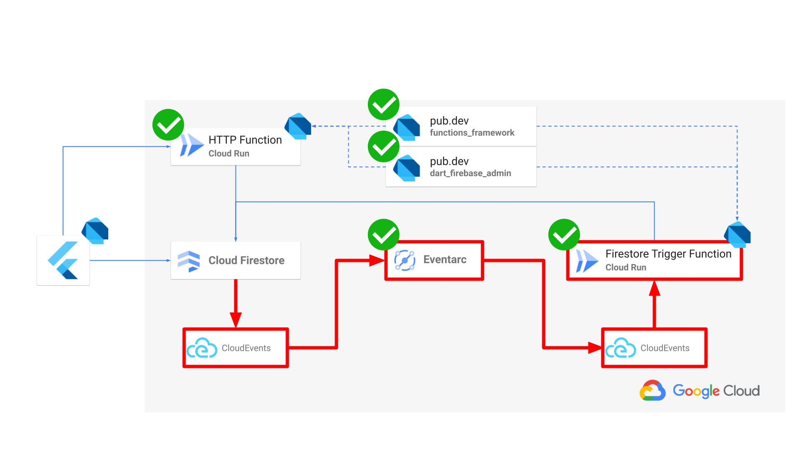

# **FlutterNinjas 2024** 

**Exploring Full-Stack Dart for Firebase Server-Side Development**

Kosuke (@kosukesaigusa)

<!-- 

Let's get started.

I'm Kosuke.

Now, I'll be presenting on "Exploring Full-Stack Dart for Firebase Server-Side Development."

-->

---

<!-- _class: lead -->

#  Hello, Flutter Ninjas! 💙

<!-- 

Hello, everyone!

... No, Hello Flutter Ninjas from all over the world!

I'm really happy to be here, and meet all of you from different places all over the world!

Thank you so much, our organizer Kei and other staffs, for holding such a wonderful conference in Japan!

-->

---

# About me

<style scoped>section { font-size: 30px; }</style>


- Kosuke Saigusa (@kosukesaigusa)
- 🇯🇵 Application Engineer located in Japan
  - Current: Omiai Inc.
  - Previous: SODA Inc. (snkrdunk)
- 💙 Flutter, Dart lover
- 👨‍💻 OSS contributor (pub.dev)
  - geoflutterfire_plus
  - flutterfire_gen
  - dart_firebase_functions
  - ...

<!-- 

So first, let me introduce myself.

I'm an application engineer, living in Tokyo.

Currently working for Omiai, which provides matchmaking, or kind of dating app designed for for serious, long-term relationships.

Previously, worked for SODA, which provides snkrdunk app, which is a marketplace app for mainly for sneakers.

The reason why I'm here is, I'm an Flutter & Dart lover, 

and have been keeping trying to contribute to the community,

by publishing packages to pub.dev,

or speak at tech-conferences like today!

-->

---

# Explore Full-Stack Dart


<!-- 

Let's move on to the today's topic.

We, all Flutter Engineers, no Flutter Ninjas love Flutter, and its programming language Dart as Well.

As you know well, Flutter framework enables us to build cross-platform apps swiftly with just Dart.

This is simple, but the one of the strongest reason why we love Flutter and Dart.

Do you know the 4th flame logo? It's a new Firebase logo, recently renewed,

also we have FlutterFire community, which enables us to effortlessly utilize features like databases, authentication, and push notifications,

without server-side development.

However, sometimes we need to write our own server-side processing by ourselves.

In that case, we write Cloud Functions, then unfortunately, Dart is left out of the picture.

So in this session, we'd like to explore possibility of Full-Stack Dart focusing of Firebase server-side processing, 

utilizing various GCP services.

-->

---

# Goal

## **Exploring Full-Stack Dart for Firebase Server-Side Development**

- Develop server-side processes for Firebase using Dart
- Integration of various GCP services
- Implement solutions with pub.dev packages:
  - `functions_framework`
  - `dart_firebase_admin`

<!-- 

In this session, we'll explore ull-Stack Dart for Firebase Server-Side Development.

So, we will learn

- How to Develop server-side processes for Firebase using Dart
- How to integrate various GCP sevices
- How to implement functions with `functions_framework`, and `dart_firebase_admin` packages.

-->

---

<!-- _class: lead -->

#  First Demo

Let's see sample app!

---

# Overview


<!-- 

Let's see overview.

This figure shows the architecture, the sample app and today's session include.

Of course, the client app is made by Flutter and Dart,

the client app can use Cloud Firestore through Firebase Client SDK,

and also can make HTTP request to HTTP Function deployed to Cloud Run.

Events occurred in Cloud Firestore are transferred to Firestore triggered function also deploy on Cloud Run, 

through Eventarc as CloudEvents format.

We try to write both functions in Dart, using two pub.dev packages.

Through the session, let't have a look at each component in detail,

and we would be able to build server-side processing for Firebase in Dart.

-->

---

# Table of Contents

1. ...
2. ...
3. ...

---

# Cloud Run


<!-- 

First, let's learn about Cloud Run.

-->

---

# Cloud Run


> Cloud Run is a managed compute platform that lets you run containers directly on top of Google's scalable infrastructure.
>
> You can deploy code **written in any programming language on Cloud Run if you can build a container image** from it.

<!--

The description is cited by GCP.

The important point is displayed in bold,

we can deploy code written in any programming language on Cloud Run

if it is possible to build its container image.

It means, it is possible to run function in Dart by using container environment.

And probably some of you have heard that 2nd Gen Cloud Functions are run on Cloud Run inside.

-->

---

# Compile Dart Program to Executable

<style scoped>section { font-size: 28px; }</style>

`bin/hello.dart`

```dart
void main(List<String> arguments) {
  print('Hello, Flutter Ninjas!');
}
```

Compile to executable:

```sh
dart compile exe bin/hello.dart -o bin/hello
```

Run:

```sh
$ ./bin/hello
Hello, Flutter Ninjas!
```

<!--

Once, apart from Cloud Run, let's learn it is possible to compile Dart program to an executable.

Here is the very simple Dart command-line app just print "Hello, Flutter Ninjas!".

by using dart compile E-X-E command, you will get an executable.

And you can run the executable like this.

-->

---

# functions_framework package


<!--

Next, lets' see functions_framework package.

-->

---

# functions_framework package

- Developed by `GoogleCloudPlatform` organization
- Provides a framework to write Dart functions and deploy it on Cloud Run, GAE, ...etc


<!--

functions_framework package is developed by GoogleCloudPlatform organization,

and it provides a framework to write Dart functions aimed at deploying them on GCP platforms

such as Cloud Run, or GAE.

-->

---

# Write HTTP Function in Dart

Write function with `@CloudFunction` in `bin/functions.dart`:

```dart
import 'package:functions_framework/functions_framework.dart';
import 'package:shelf/shelf.dart';

@CloudFunction()
Response hello(Request request) => Response.ok('Hello, Flutter Ninjas!');
```

Generate code:

```sh
dart pub run build_runner build -d
```

<!--

By using functions_framework package, you can easily define HTTP Function with `@CloudFunction` annotation.

Here, hello function, which simply returns success response with the message, saying "Hello, Flutter Ninjas!".

And generate code with build_runner.

-->

---

Generated code `bin/server.dart`:

```dart
import 'package:functions_framework/serve.dart';
import 'package:hello_server/functions.dart' as function_library;

Future<void> main(List<String> args) async {
  await serve(args, _nameToFunctionTarget);
}

FunctionTarget? _nameToFunctionTarget(String name) => switch (name) {
      'hello' => FunctionTarget.http(function_library.hello),
      _ => null
    };
```

<!--

You can find the generated code in `bin/server.dart`.

It gives function entry point as main function with the arguments,

and in the arguments, target functions is included.

In the switch expression, it calls hello function, if the target function is equal to hello.

-->

---

Launch server:

```sh
$ dart run bin/server.dart
Listening on :8080
```

Request to server:

```sh
$ curl http://localhost:8080
Hello, Flutter Ninjas!
```

<!--

By running `dart run` command, you can launch the server locally on your machine.

And when you make request to the local server, it responses with "Hello, Flutter Ninjas!" message.

-->

---

## Run in Container

<style scoped>section { font-size: 28px; }</style>

`Dockerfile`

```Dockerfile
FROM dart:stable AS build

WORKDIR /app

COPY . .
RUN dart pub get
RUN dart pub run build_runner build -d
RUN dart compile exe bin/server.dart -o bin/server

FROM scratch

COPY --from=build /runtime/ /
COPY --from=build /app/bin/server /app/bin/

EXPOSE 8080
ENTRYPOINT ["/app/bin/server", "--target=hello", "--signature-type=http"]
```

<!--

You can run the same function in container environment as well.

This is Dockerfile to build the container.

In the build step, 

- Copy the whole source codes
- Install dependencies by running `dart pub get`
- Generate codes by build_runner
- Then, compile Dart script to an executable

And next, in the scratch step,

- Copy the compiled executable file and place it to the right place
- Expose 8080 PORT
- And define ENTRYPOINT, with options such as
  - Path to the executable file
  - The target function name
  - and function signature type, in this case, specify http because it's HTTP function

-->

---

Build container:

```sh
docker build -t hello .
```

Run it:

```sh
$ docker run -it -p 8080:8080 --name app hello
Listening on :8080
```

Request to server:

```sh
$ curl http://localhost:8080
Hello, Flutter Ninjas!
```

<!--

You can build and run docker container by `docker build` and `docker run` commands.

And when you make request to the server, it should return successful response!

-->

---

<!-- _class: lead -->

#  Demo

Try to run hello function on local machine!

---

# Deploy HTTP Function on Cloud Run

<style scoped>section { font-size: 30px; }</style>

Deploy on Cloud Run with `Dockerfile` using `gcloud` CLI:

```sh
gcloud run deploy hello \    # Function (service) name
  --source=. \               # Path to Dockerfile
  --platform=managed \       # For Cloud Run
  --allow-unauthenticated    # For public access
```

Request to Cloud Run:

```sh
$ curl https://hello-<generated-url>-an.a.run.app
Hello, Flutter Ninjas!
```

⚠️ Be careful of unauthenticated functions.

<!--

As last step of learning how to run Dart on Cloud Run, we need to learn how to deploy the function on Cloud Run.

But don't worry, it's simple, just use `gcloud` CLI.

In order to deploy HTTP function on Cloud Run, run `gcloud run deploy` command with

- Function name, hello
- with Dockerfile path as source option

After deployment completes, of course you can request to deployed function!

-->

---

<!-- _class: lead -->


<!--

You can find deployed function on GCP Cloud Run console.

-->

---


<!--

So, we've learned how to define HTTP function in Dart,

using functions_framework package,

and how to deploy them on Cloud Run!

-->

---

<!-- _class: lead -->

#  Demo

Deploy hello function to Cloud Run!

---

# dart_firebase_admin package


<!--

As next step, let me introduce another important package dart_firebase_admin

-->

---

# dart_firebase_admin package

- Developed by `invertase` organization
- Remi is the main contributor


<!--

dart_firebase_admin package is developed by `invertase` organization, probably many of you know well,

and Remi is the main contributor.

-->

---

# dart_firebase_admin package

```dart
final adminApp = FirebaseAdminApp.initializeApp(
  'your-project-id',
  Credential.fromServiceAccountParams(
    clientId: 'your-client-id',
    privateKey: 'your-private-key',
    email: 'your-email',
  ),
);

final firestore = Firestore(adminApp);
final auth = Auth(adminApp);
final messaging = Messaging(adminApp);
```

<!--

The usage is simple, you need to initialize `FirebaseAdminApp` by using your own credential,

then you can instantiate various Firebase features

such as Cloud Firestore, Firebase Auth, and Cloud Messaging.

-->

---

Sending Cloud Messaging example:

```dart
Future<void> main async {
  final messaging = Messaging(adminApp);
  await messaging.send(
    TokenMessage(
      token: 'some-fcm-token',
      notification: Notification(
        title: 'FlutterNinjas 2024!',
        body: 'Welcome to FlutterNinjas!',
      ),
    ),
  );
}
```

<!--

As you can see, thanks firebase_admin package, you can write typical server-side processing,

sending Cloud Messaging is available in Dart!

-->

---

# dart_firebase_admin package


<!--

We've learned the usage of dart_firebase_admin package.

-->

---

<!-- _class: lead -->

#  Demo

Send FCM to mobile app from local admin SDK!

---

# Transfer Cloud Firestore event to Cloud Run


<!--

There might not be many people who are familiar with Eventarc and CloudEvents,

but this is an important part of the architecture.

Let me explain how to transfer events occurred in Cloud Firestore to Cloud Run,

by using GCP Eventarc service.

-->

---

# Eventarc


> Eventarc lets you build **event-driven architectures** without having to implement, customize, or maintain the underlying infrastructure. **Eventarc offers a standardized solution to manage the flow of state changes, called events, between decoupled microservices.**

<!--

Eventarc is one of the services provided by GCP,

which enables us to handle events ocurred between different microservices.

So, in the today's sessions architecture, we will use Eventarc 

to transfer Cloud Firestore triggered to Cloud Run function.

This is how we realize Cloud Firestore triggered function.

-->

---

# CloudEvents


> **CloudEvents is a specification for describing event data in a common way**.
>
> CloudEvents seeks to dramatically simplify event declaration and delivery across services, platforms, and beyond!

<!--

As I explained now, Eventarc handles events occurred in GCP service as CloudEvents, 

and its CloudEvents is a common specification to describe such event data.

-->

---

# Write CloudEvents triggered Function in Dart


<!--

Finally, let's have look at how to write Firestore triggered function in Dart!

-->

---

# Write CloudEvents triggered Function in Dart

Define function with `@CloudFunction()`, and give two parameters:

- `CloudEvent event`
- `RequestContext context`

```dart
@CloudFunction()
void oncreateevent(CloudEvent event, RequestContext context) 
  => Response.ok('Hello, Flutter Ninjas!');
```

⚠️ Only lowercase letters, numbers and '-' are allowed for function name.

<!--

Here, as well, we use functions_framework package. 

They provides not only HTTP function, but also CloudEvents triggered function as well!

With `@CloudFunction` annotation, you can write your own CloudEvents triggered function,

with two parameters

- CloudEvent
- RequestContext

This is too simple, because just returns "Hello, Flutter Ninjas!" message, but let's see the details later.

-->

---

# Deploy CloudEvents triggered Function on Cloud Run

<style scoped>h1 { font-size: 44px;} section { font-size: 30px; }</style>

Set `--signature-type=cloudevent` to `ENTRYPOINT` option:

```Dockerfile
FROM dart:stable AS build

WORKDIR /app
COPY . .
RUN dart pub get
RUN dart pub run build_runner build -d
RUN dart compile exe bin/server.dart -o bin/server

FROM scratch
COPY --from=build /runtime/ /
COPY --from=build /app/bin/server /app/bin/

EXPOSE 8080
ENTRYPOINT ["/app/bin/server", "--target=oncreateevent", "--signature-type=cloudevent"]
```

<!--

In order to Deploy CloudEvents triggered Function on Cloud Run,

its Dockerfile is almost the same as HTTP function.

Only the difference is is `signature-type` option, you need to specify `cloudevent` there in this time.

-->

---

# Deploy Eventarc trigger

<style scoped>section { font-size: 32px; }</style>

- Deploy Eventarc trigger using `gcloud` CLI
- Transfer:
  - from Cloud Firestore: `type=google.cloud.firestore.document.v1.created`
  - to Cloud Run: `oncreateevent`

```sh
gcloud eventarc triggers create oncreateevent \  # Trigger name
  --destination-run-service=oncreateevent \      # Destination function name
  --event-filters="type=google.cloud.firestore.document.v1.created" \  # Event type
  --event-filters="database=(default)" \ 
  --event-filters="namespace=(default)" \ 
  --event-filters-path-pattern="document=events/{eventId}" \  # Target path
  --event-data-content-type="application/protobuf" \ 
  --service-account="your-service-account-name@project-id.iam.gserviceaccount.com"
```

<!--

Then, in order to deploy eventarc trigger, you can also use `gcloud` CLI.

The command you will is `gcloud eventarc triggers create`.

And give information such as 

- Trigger name
- Destination Cloud Run function (service) name
- Event type
- Target path

-->

---

<!-- _class: lead -->


<!--

When the trigger is successfully deployed, you can find detailed information in GCP console.

Information on the screenshot is corresponding to what we gave to the `gcloud` command.

-->

---

<!-- _class: lead -->

#  Demo

Try to create Eventarc trigger!

---



<!--

So, now we've learned about Eventarc and how to transfer events from Cloud Firestore to Cloud Run function written in Dart.

We've already known about how to build Flutter app in Dart, and just use Firebase Client SDK to use Cloud Firestore, so we've learned almost everything we need to know about.

But...

-->

---

# How to handle Raw CloudEvents data?

Request body is in `application/protobuf` byte data format:

```json
[10, 195, 3, 10, 84, 112, 114, 111, 106, 101, 99, 116, 115, 47, 102, 117 ...]
```

<!--

The request body comes to Cloud Run function, is in `application/protobuf` byte data format, like you see on the screen.

So, we need to somehow prase the byte data.

-->

---

<style scoped>section { font-size: 28px; }</style>

# How to handle Raw CloudEvents data?

CloudEvents metadata found in header such as:

- Triggered document
- Triggered event type

```json
{
  "ce-dataschema": "https://github.com/googleapis/.../events/cloud/firestore/v1/data.proto",
  "authorization": "Bearer ...",
  "ce-subject": "documents/todos/6iGrCr5nJar6NNB8gPog",
  "ce-source": "//firestore.googleapis.com/.../databases/(default)",
  "ce-type": "google.cloud.firestore.document.v1.created",
  "content-type": "application/protobuf",
  "ce-document": "todos/6iGrCr5nJar6NNB8gPog",
  "ce-project": "...",
  ...
}
```

<!--

And also the request header is a little complicated.

The JSON is simplified for explanation, but it includes various metadata

such as triggered document and triggered event type.

-->

---

# firebase-functions (Node.js)

<style scoped>section { font-size: 28px; }</style>

Node.js SDK provides:

- Document path parameters from `context.params.documentId`
- Triggered `DocumentSnapshot snapshot`

```js
import * as functions from 'firebase-functions'

const onCreateTodo = functions
  .region(`asia-northeast1`)
  .firestore.document(`todos/{todoId}`)
  .onCreate(async (snapshot, context) => {
    const todoId = context.params.todoId
    const data = snapshot.data()
    const title = data.title
    // ...
  })
```

<!--

When it comes to Node.js firebase-function package,

Probably some of you have used them, but

in such an easy way, 

they enable us to instantly use documentId from `context.params`,

and also the provide triggered `DocumentSnapshot` data.

-->

---

<!-- _class: lead -->

#  Possible to write in Dart?

<!--

Is is possible in Dart?

So I tried to make it possible in Dart!

-->

---

# dart_firebase_functions package

- ⚠️ Still in early stages
- Provides Node.js-like Firebase functions capability in Dart!


<!--

It's dart_firebase_functions package.

Still in early stages, but I tried to develop and published it recently.

This package provides Node.js-like Firebase functions capability in Dart!

-->

---

# onCreate

<div class="two-columns">

<div>

```dart
@OnDocumentCreated('todos/{todoId}')
Future<void> oncreatetodo(
  ({String todoId}) params,
  QueryDocumentSnapshot snapshot,
  RequestContext context,
) async {
  final todoId = params.todoId;
  final data = snapshot.data();
  final title = data?['title'];
  // ...
}
```

</div>

<div>

```js
const onCreateTodo = functions
  .region(`asia-northeast1`)
  .firestore.document(`todos/{todoId}`)
  .onCreate(async (snapshot, context) => {
    const todoId = context.params.todoId
    const data = snapshot.data()
    const title = data.title
    // ...
  })
```

</div>

</div>

<!--

Let's see and example how to write `onCreate` trigger, comparing to Node.js one.

For now, we need use `OnDocumentCreated` annotation and code generation before installing concept of Macro, but they look very similar to each other.

In Dart function as well, you can get document ID from the `Record` typed params,

and triggered `DocumentSnapshot` from the function parameter.

-->

---

# onUpdate

<div class="two-columns">

<div>

```dart
@OnDocumentUpdated('todos/{todoId}')
Future<void> onupdatetodo(
  ({String todoId}) params,
  ({
    QueryDocumentSnapshot before,
    QueryDocumentSnapshot after,
  }) snapshot,
  RequestContext context,
) async {
  final todoId = params.todoId;
  final before = snapshot.before.data();
  final after = snapshot.after.data();
  final newTitle = after.title;
  // ...
}
```

</div>

<div>

```js
const onUpdateTodo = functions
  .region(`asia-northeast1`)
  .firestore.document(`todos/{todoId}`)
  .onUpdate(async (snapshot, context) => {
    const todoId = context.params.todoId
    const before = snapshot.before.data()
    const after = snapshot.after.data()
    const newTitle = after.title
    // ...
  })
```

<!--

For onUpdate trigger, you can get `before` and `after` data from the `DocumentSnapshot` in the exactly same way as the Node.js one.

-->

</div>

</div>

---

# onDelete

<div class="two-columns">

<div>

```dart
@OnDocumentDeleted('todos/{todoId}')
Future<void> ondeletetodo(
  ({String todoId}) params,
  QueryDocumentSnapshot snapshot,
  RequestContext context,
) async {
  final todoId = params.todoId;
  final data = snapshot.data();
  final title = data?.title;
  // ...
}
```

</div>

<div>

```js
const onDeleteTodo = functions
  .region(`asia-northeast1`)
  .firestore.document(`todos/{todoId}`)
  .onUpdate(async (snapshot, context) => {
    const todoId = context.params.todoId
    const data = snapshot.data()
    const title = data.title
    // ...
  })
```

</div>

</div>

<!--

On delete, ...

-->

---

# onWrite

<div class="two-columns">

<div>

```dart
@OnDocumentUpdated('todos/{todoId}')
Future<void> onwritetodo(
  ({String todoId}) params,
  ({
    QueryDocumentSnapshot before,
    QueryDocumentSnapshot after,
  }) snapshot,
  RequestContext context,
) async {
  final todoId = params.todoId;
  final before = snapshot.before.data();
  final after = snapshot.after.data();
  final newTitle = after.title;
  // ...
}
```

</div>

<div>

```js
const onWriteTodo = functions
  .region(`asia-northeast1`)
  .firestore.document(`todos/{todoId}`)
  .onWrite(async (snapshot, context) => {
    const todoId = context.params.todoId
    const before = snapshot.before.data()
    const after = snapshot.after.data()
    const newTitle = after?.title
    // ...
  })
```

</div>

</div>

<!--

And on write trigger as well!

-->

---

# Nested Collection

```dart
@OnDocumentCreated('foos/{fooId}/bars/{barId}')
Future<void> oncreatebar(
  ({String fooId, String barId}) params,
  QueryDocumentSnapshot snapshot,
  RequestContext context,
) async {
  final fooId = params.fooId;
  final barId = params.barId;
  final data = snapshot.data();
  // ...
}
```

<!--

And of course, it is compatible to parse nested collection path like this.

-->

---

Write Firestore triggered function in Dart:

```dart
@OnDocumentCreated('todos/{todoId}')
Future<void> oncreatetodo(
  ({String todoId}) params,
  QueryDocumentSnapshot snapshot,
  RequestContext context,
) async {
  // ...
}
```

Generate code:

```sh
dart pub run build_runner build -d
```

<!--

Usage is simple, we are finally able to write Firestore triggered function in Dart, 

by using dart_firebase_function package, which depends on functions_framework package inside,

and or course, you can use any Firebase Admin feature by dart_firebase_admin package in the function,

And generate code by build_runner

-->

---

# Deploy it on Cloud Run

<style scoped>section { font-size: 30px; }</style>

Set `--signature-type=cloudevent` to `ENTRYPOINT` option:

```Dockerfile
FROM dart:stable AS build

WORKDIR /app
COPY . .
RUN dart pub get
RUN dart pub run build_runner build -d
RUN dart compile exe bin/server.dart -o bin/server

FROM scratch
COPY --from=build /runtime/ /
COPY --from=build /app/bin/server /app/bin/

EXPOSE 8080
ENTRYPOINT ["/app/bin/server", "--target=oncreateevent", "--signature-type=cloudevent"]
```

<!--

And the Dockerfile for deployment is complete the same as we saw before!

-->

---

<!-- _class: lead -->

#  Final Demo

Let's see sample app's server-side code!

<!--

As final demo, let's see the sample app's server-side code together!

-->

---

# Summary

- In container, Dart executable can be run (Cloud Run)
- HTTP and CloudEvents triggered functions are available in Dart, thanks to `functions_framework` package
- Firebase Admin SDK is available, thanks to `dart_firebase_admin` package
- Eventarc transfers CloudEvents from Cloud Firestore to Cloud Run
- `dart_firebase_function` package provides Node.js-like Firebase functions capability in Dart

<!--

So let's summarize this session, important points are here:

-->

---

# Explore Full-Stack Dart


<!--

Thank you so much for exploring Full-Stack Dart for Firebase server-side processing!

-->

---

<!-- _class: lead -->

#  Thank you
